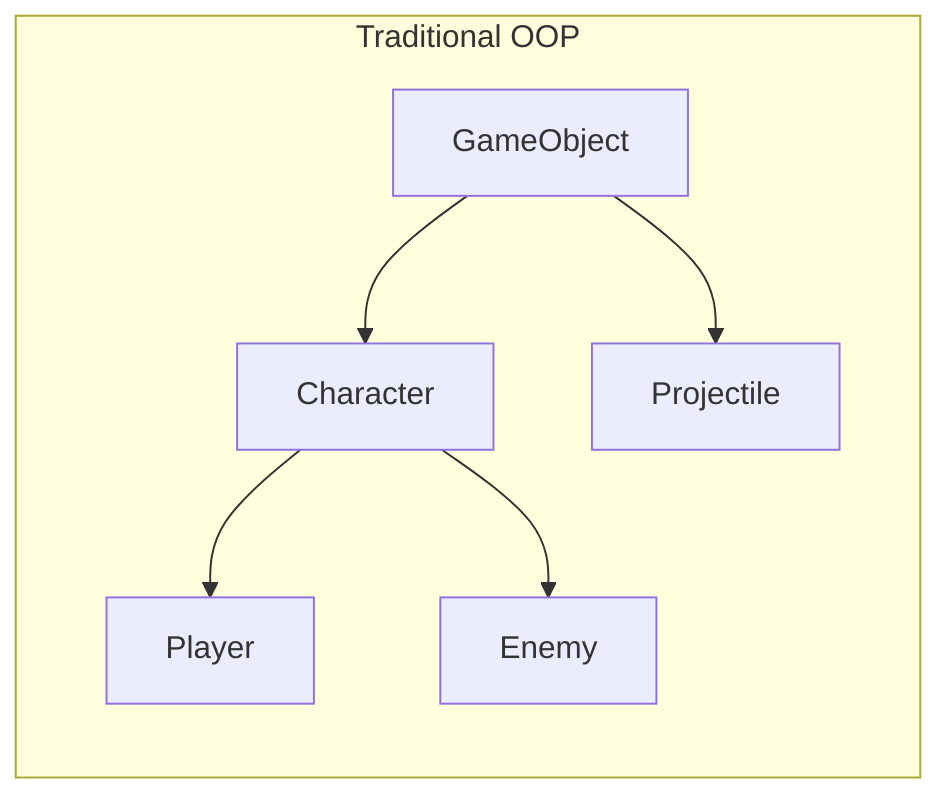
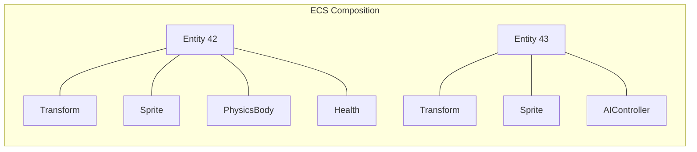
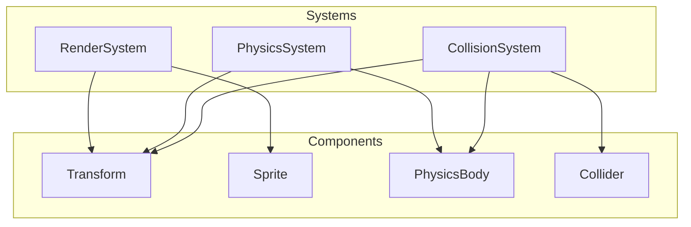
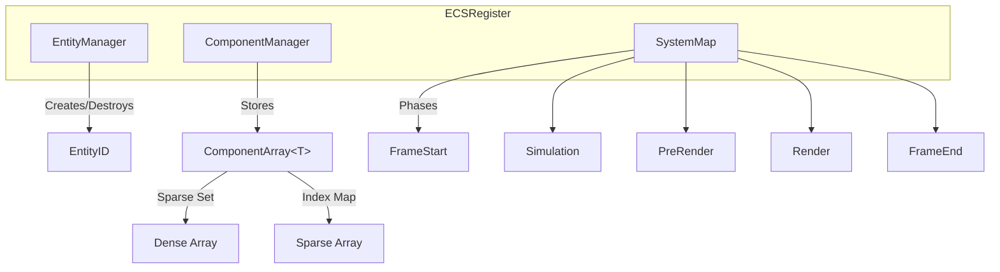
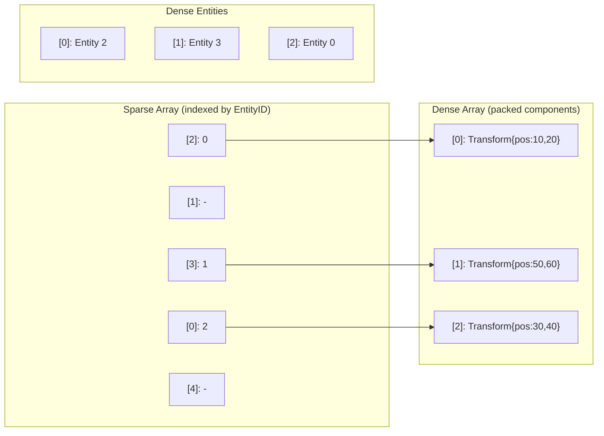
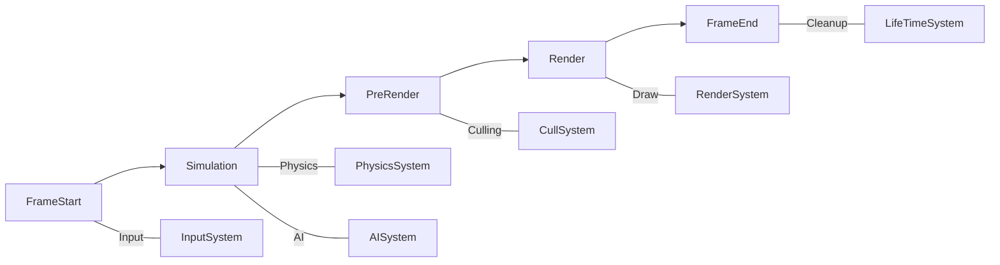

import { getEntry } from 'astro:content';

# Building a Modern ECS for UMBRA Engine

_A deep dive into the Entity Component System powering our 2D game engine_

---

## What is ECS?

Entity Component System (ECS) is an architectural pattern that favors **composition over inheritance**. Instead of deep class hierarchies, game objects are built by combining small, reusable data chunks.





The three pillars:

- **Entities** - Just IDs (integers), no data or behavior
- **Components** - Pure data containers (no logic)
- **Systems** - Logic that operates on entities with specific component combinations

---

## Why ECS? The Advantages

### 1. Cache-Friendly Memory Layout

Traditional OOP scatters data across the heap. ECS packs components contiguously:

```
Traditional:        ECS (Sparse Set):
[Player1]           Transform[] = [T1, T2, T3, T4, T5...]  <- Cache line friendly!
  [Transform]       Sprite[]    = [S1, S2, S3, S4, S5...]
  [Sprite]          Physics[]   = [P1, P2, P3...]
  [Physics]
[Player2]
  [Transform]       Iteration = Sequential memory access = Fast!
  [Sprite]
  ...
```

### 2. Flexibility Through Composition

Need a moving platform? Just combine:

```cpp
world->AddComponent<TransformComponent>(entity, position, size);
world->AddComponent<PhysicsBodyComponent>(entity, mass, velocity);
// No new class needed!
```

### 3. Decoupled Systems

Systems are independent - add physics without touching rendering:



### 4. Easy Serialization

Components are plain data - trivial to save/load:

```cpp
struct TransformComponent : Component {
    Math::Vector2f Position;
    Math::Vector2f Size;
    float Angle = 0;
    // Just data, easily serializable
};
```

---

## UMBRA's ECS Implementation

### Architecture Overview



### Entities: Just Numbers

Entities are lightweight identifiers - nothing more than a `uint64`:

```cpp
using EntityID = uint64;

class EntityManager {
    BitField<MAX_ENTITY> mEntityAliveFlags;  // Tracks which IDs are alive
    Queue<EntityID> mFreeIds;                // Recycle freed IDs
    EntityID mNextEntityID = 0;

public:
    EntityID CreateEntity() {
        EntityID id;
        if (!mFreeIds.empty()) {
            id = mFreeIds.front();    // Reuse old ID
            mFreeIds.pop();
        } else {
            id = mNextEntityID++;     // Or allocate new
        }
        mEntityAliveFlags.set(id, true);
        EntitiesAdded.emplace(id);    // Defer processing
        return id;
    }
};
```

Key insight: **Deferred operations**. Destroying an entity just marks it for later removal - actual deletion happens during cleanup to avoid iterator invalidation.

### Component Storage: Sparse Sets

The heart of our performance story. Components are stored in **Sparse Sets** - a data structure optimized for:

- O(1) insertion
- O(1) deletion
- O(1) lookup
- Cache-friendly iteration



```cpp
template <typename T>
class ComponentArray : public IBaseComponentArray {
    Vector<T> mDense;              // Packed component data
    Vector<EntityID> mDenseEntities;
    Vector<size_t> mSparse;        // EntityID -> dense index

public:
    void Insert(EntityID _entity, T _component) {
        if (_entity >= mSparse.size()) {
            mSparse.resize(_entity + 1, INVALID_INDEX);
        }
        size_t denseIndex = mDense.size();
        mSparse[_entity] = denseIndex;
        mDense.emplace_back(std::move(_component));
        mDenseEntities.emplace_back(_entity);
    }

    // O(1) removal via swap-with-last
    bool Remove(EntityID _entity) {
        size_t removedIndex = mSparse[_entity];
        size_t lastIndex = mDense.size() - 1;

        if (removedIndex != lastIndex) {
            // Swap last element into removed slot
            mDense[removedIndex] = std::move(mDense[lastIndex]);
            mDenseEntities[removedIndex] = mDenseEntities[lastIndex];
            mSparse[mDenseEntities[removedIndex]] = removedIndex;
        }

        mDense.pop_back();
        mDenseEntities.pop_back();
        mSparse[_entity] = INVALID_INDEX;
        return true;
    }

    T& Get(EntityID _entity) {
        return mDense[mSparse[_entity]];
    }
};
```

### Component Signatures: Bitsets

Each entity has a **signature** - a bitset indicating which components it has:

```cpp
using ComponentMask = BitField<MAX_COMPONENTS>;  // std::bitset<64>

// Generate unique ID per component type at compile time
template <typename T>
inline static ComponentID GetID() {
    static ComponentID typeID{getUniqueComponentID()};
    return typeID;
}

// Create a signature from component types
template <typename Component, typename... Rest>
ComponentMask CreateSignature() {
    ComponentMask signature;
    signature.set(ComponentIDHelper::GetID<Component>());
    if constexpr (sizeof...(Rest) > 0) {
        signature |= CreateSignature<Rest...>();
    }
    return signature;
}
```

Matching is a simple bitwise AND:

```cpp
// Does entity have all components required by system?
bool matches = (systemSignature & entitySignature) == systemSignature;
```

### Systems & Views

Systems define which components they need through a **View**:

```cpp
class RenderSystem : public System {
public:
    RenderSystem(IRenderDevice* _device)
        : System(std::make_unique<ECView<TransformComponent, SpriteComponent>>())
    {
        mRenderDevice = _device;
    }

    void Update() override {
        // Iterate only entities with Transform AND Sprite
        for (EntityID entity : mView->mEntities) {
            auto* transform = mView->ecsRegister->GetComponent<TransformComponent>(entity);
            auto* sprite = mView->ecsRegister->GetComponent<SpriteComponent>(entity);

            // Render logic...
        }
    }
};
```

### System Execution Phases

Systems are organized into phases for deterministic execution order:



```cpp
enum class ESystemPhase {
    FrameStart,    // Collect input
    Simulation,    // Physics, AI, gameplay
    PreRender,     // Frustum culling, LOD
    Render,        // Draw calls
    FrameEnd       // Cleanup, lifetime management
};

// Priority within phase (lower = earlier)
world->AddSystem(ESystemPhase::Simulation, 10, physicsSystem);
world->AddSystem(ESystemPhase::Simulation, 20, collisionSystem);
world->AddSystem(ESystemPhase::Render, 0, renderSystem);
```

---

## Real-World Usage Example

```cpp
class GameScene : public Scene {
    void Initialize() override {
        World* world = GetWorld();

        // Create player entity
        EntityID player = world->CreateEntity();

        world->AddComponent<TransformComponent>(player,
            Math::Vector2f(400, 300),    // Position
            Math::Vector2f(64, 64),      // Size
            0.0f,                        // Angle
            Math::Vector2f(0.5f, 0.5f)   // Pivot
        );

        world->AddComponent<SpriteComponent>(player,
            AssetManager::Get().LoadTexture("player.png"),
            10,                          // Z-order
            Color::White
        );

        world->AddComponent<PhysicsBodyComponent>(player,
            1.0f,                        // Mass
            Math::Vector2f(0, 0)         // Initial velocity
        );

        world->AddTag(player, "Player");

        // Add custom input system
        auto inputSystem = std::make_shared<PlayerInputSystem>();
        world->AddSystem(ESystemPhase::FrameStart, 0, inputSystem);
    }

    void OnUpdate(float _dt) override {
        // Query entities by tag
        Vector<EntityID> enemies = GetWorld()->FindEntitiesByTag("Enemy");

        for (EntityID enemy : enemies) {
            auto* transform = GetWorld()->GetComponent<TransformComponent>(enemy);
            // Game logic...
        }
    }
};
```

---

## Performance Characteristics

| Operation          | Complexity     | Notes                      |
| ------------------ | -------------- | -------------------------- |
| Create Entity      | O(1)           | ID recycling via queue     |
| Destroy Entity     | O(1)\*         | Deferred until cleanup     |
| Add Component      | O(1) amortized | Sparse set insert          |
| Remove Component   | O(1)           | Swap-with-last             |
| Get Component      | O(1)           | Direct index lookup        |
| Iterate Components | O(n)           | Cache-friendly dense array |
| System Matching    | O(1)           | Bitwise AND                |
| Find by Tag        | O(1) avg       | Hash map lookup            |

\*Actual removal is O(k) where k = number of components on entity

---

## Lessons Learned

1. **Deferred operations are essential** - Modifying entities during iteration causes crashes. Queue changes for cleanup phase.

2. **Sparse sets beat maps** - We initially used `std::unordered_map` for components. Switching to sparse sets gave 3-4x iteration speedup.

3. **64 components is enough** - Using `std::bitset<64>` keeps signatures in a single cache line.

4. **Tags need their own index** - Linear search for named entities is slow. A secondary `map<string, set<EntityID>>` makes `FindByTag` instant.

5. **Views should cache** - Recalculating which entities match each frame is wasteful. Views maintain a set that updates incrementally.

---

[See recent updates](/portfolio/blog/tag/umbra)