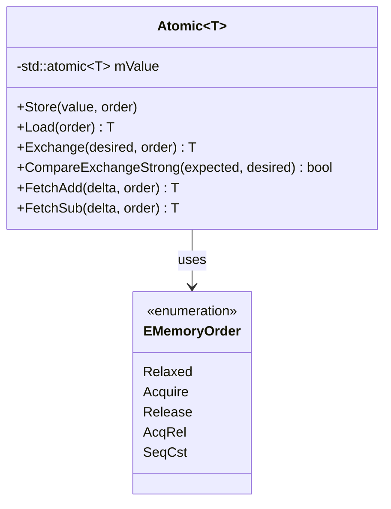
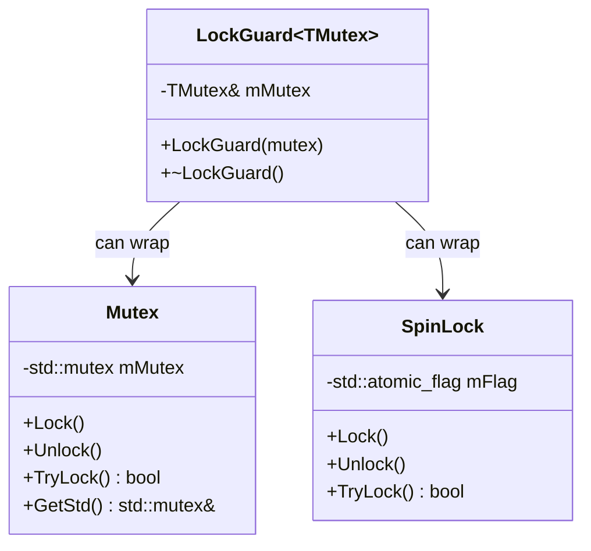
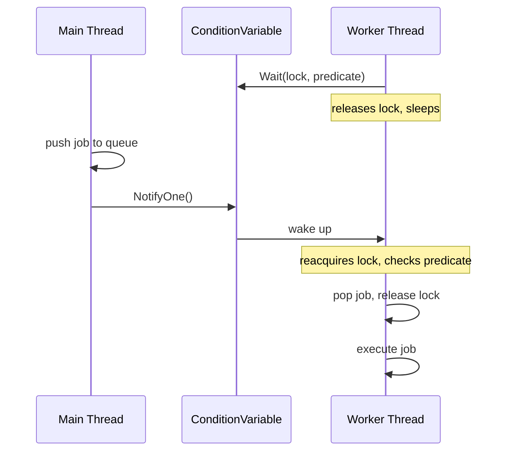
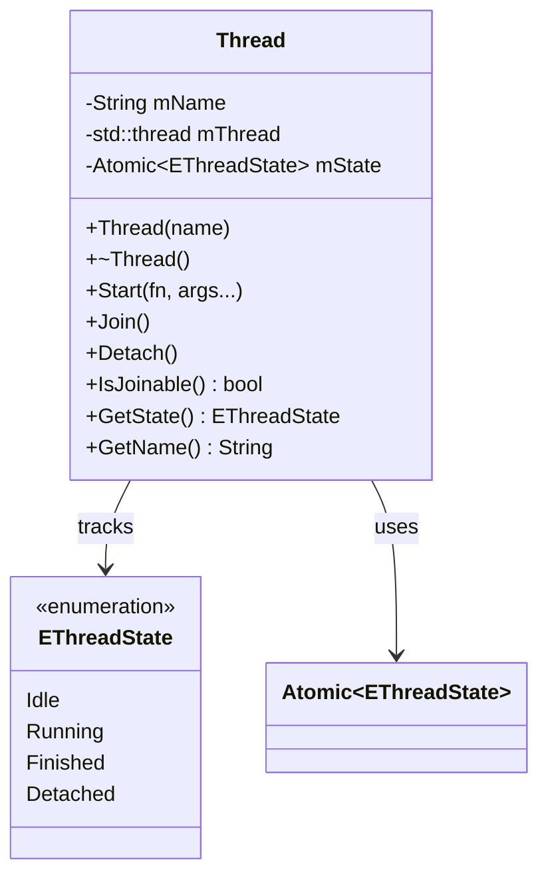
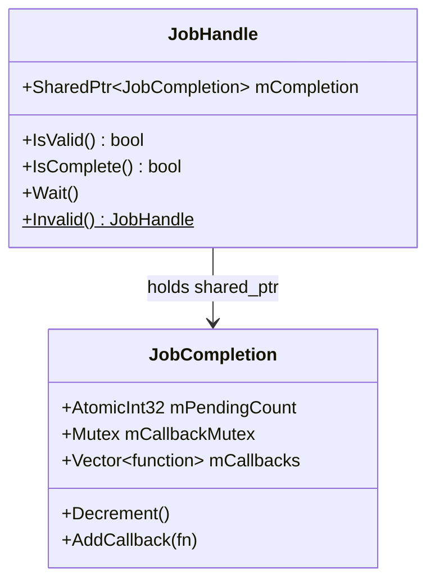
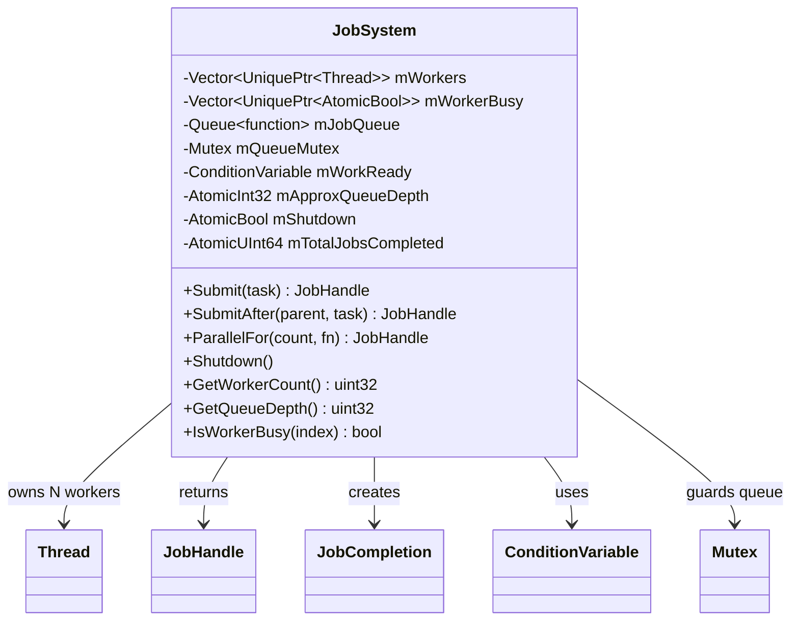
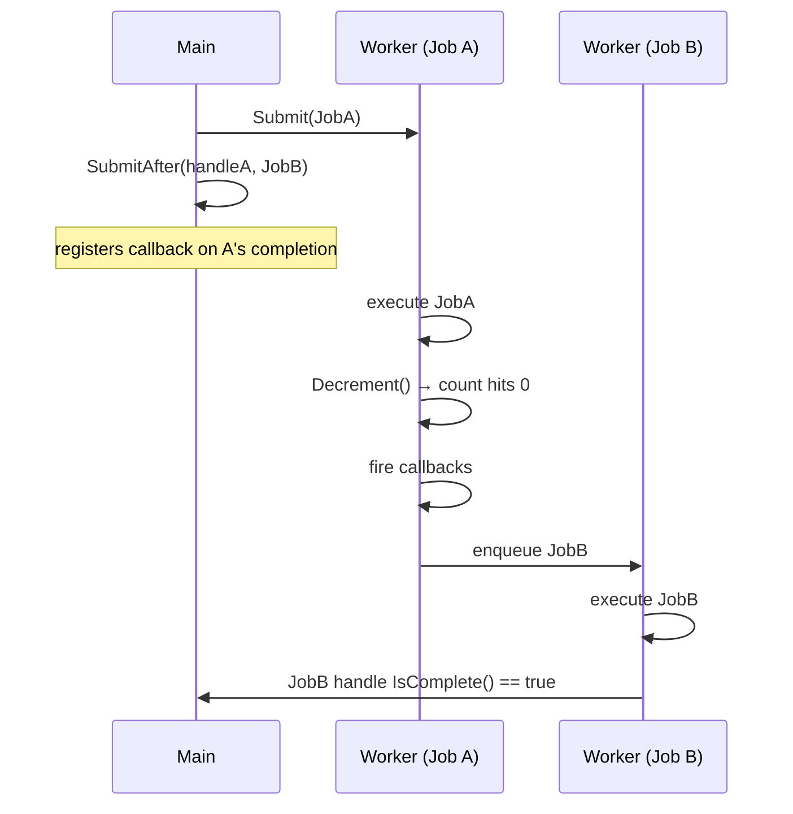
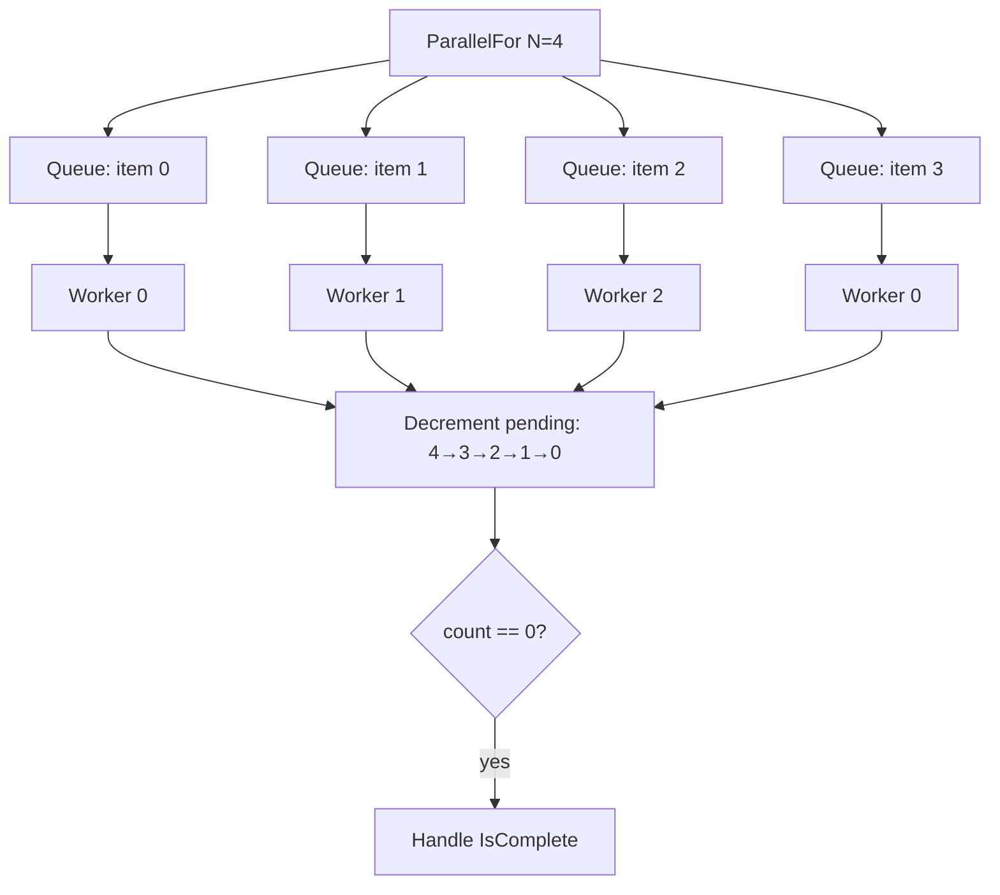
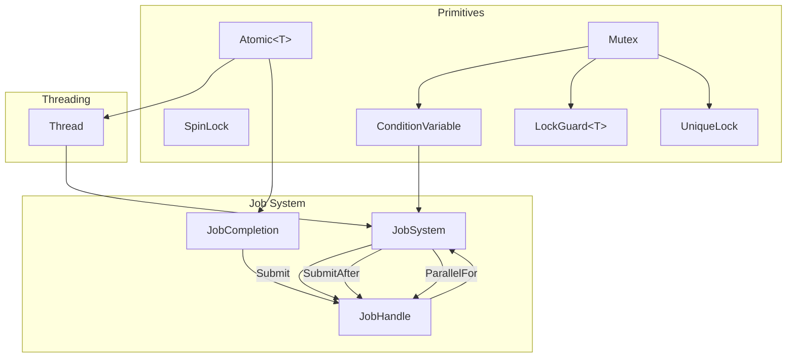

## The Problem with Doing Everything on One Thread

A typical game loop looks innocent enough:

```
while (running) {
    processInput();
    simulate();
    render();
}
```

But as the engine scales, some of these steps get expensive. Loading a texture from disk, parsing a level file, simulating hundreds of physics bodies — all of this happening sequentially means the game stalls while it works. The GPU sits idle, CPU cores sit idle, and the player sees a frame rate spike.

The solution is multithreading. But multithreading is famously tricky. UMBRA approaches it with a layered primitive stack, building up from raw thread management all the way to a high-level job dependency graph.

Let's walk through each layer.

---

## Layer 1 — The Building Blocks

### `Atomic<T>` — Lock-Free Shared State

The foundation of all thread-safe communication is the atomic variable. UMBRA wraps `std::atomic<T>` in a typed `Atomic<T>` class that enforces the engine's naming conventions and makes memory ordering explicit via `EMemoryOrder`.

```cpp
Atomic<int32> mPendingCount{1};

// Decrement and return the old value, with acquire-release ordering
int32 prev = mPendingCount.FetchSub(1, EMemoryOrder::AcqRel);
```

Memory ordering is the part most programmers never think about until bugs appear. Here's what the three main orderings mean in practice:

| Order | What it guarantees |
|---|---|
| `Relaxed` | Just atomicity — no ordering constraints. Use for stats/counters. |
| `Acquire` | All reads/writes after this point see everything written before a matching Release. |
| `Release` | All reads/writes before this point are visible to any thread that does an Acquire. |
| `AcqRel` | Both combined — used in read-modify-write ops like `FetchSub`. |

The engine defines typed aliases for the most common usages: `AtomicBool`, `AtomicInt32`, `AtomicUInt64`, etc.



---

### `Mutex` and `SpinLock` — Two Flavors of Mutual Exclusion

Both prevent two threads from entering a critical section simultaneously. The difference is *how they wait*:

**`Mutex`** asks the OS to put the waiting thread to sleep. When the lock is released, the OS wakes it. This involves a syscall — ~100–1000ns of overhead — but burns zero CPU while waiting.

**`SpinLock`** uses `std::atomic_flag::test_and_set()` in a tight loop. It never sleeps, so it reacts instantly, but it burns a full CPU core while spinning.

```cpp
// SpinLock internals
void Lock() {
    while (mFlag.test_and_set(std::memory_order_acquire)) {
        UMBRA_CPU_PAUSE(); // SSE _mm_pause() on x86 — reduces pipeline pressure
    }
}
```

`UMBRA_CPU_PAUSE()` is worth calling out: on x86, `_mm_pause` is a single instruction that tells the CPU "I'm in a spin loop". It reduces power consumption and prevents the CPU from aggressively speculating on the spin condition. On ARM it maps to `yield`.



**Rule of thumb:** use `SpinLock` when the critical section is a single pointer swap or counter increment. Use `Mutex` for anything involving I/O, allocation, or computation.

Both integrate with `LockGuard<T>` for RAII-safe locking:

```cpp
{
    LockGuard<Mutex> lock(mQueueMutex);
    mJobQueue.push(task);
} // mutex released automatically here
```

---

### `ConditionVariable` — Sleeping Until Work Arrives

`Mutex` protects data. `ConditionVariable` lets threads *sleep* until that data changes state.

The classic producer-consumer pattern:

```cpp
// Producer (main thread submitting a job)
{
    LockGuard<Mutex> lock(mtx);
    mJobQueue.push(task);
}
cv.NotifyOne(); // wake one sleeping worker

// Consumer (worker thread)
{
    UniqueLock lock(mtx);
    cv.Wait(lock, [&] { return !mJobQueue.empty() || mShutdown; });
    auto task = mJobQueue.front();
    mJobQueue.pop();
}
task(); // execute outside the lock
```

The `Wait()` call atomically releases the mutex and puts the thread to sleep. When `NotifyOne()` or `NotifyAll()` fires, the thread wakes, reacquires the mutex, and re-evaluates the predicate. The predicate loop handles **spurious wakeups** — a quirk of most OS implementations where a thread can wake for no reason.

`UniqueLock` is required here (not `LockGuard`) because the condition variable needs to manually release and reacquire the lock during the sleep cycle.



---

## Layer 2 — The `Thread` Class

With the primitives in place, UMBRA wraps `std::thread` in an RAII `Thread` class that adds:

- **Named threads** — the OS thread name is set via `SetThreadDescription` (Windows) or `pthread_setname_np` (Linux/macOS), which makes profiler output readable
- **State tracking** via `EThreadState` (`Idle`, `Running`, `Finished`, `Detached`)
- **Auto-join on destruction** — prevents the classic "forgot to join" crash

```cpp
enum class EThreadState : uint8 {
    Idle,     // Created, not yet started
    Running,  // Currently executing
    Finished, // Completed execution
    Detached  // Detached, no longer owned by this handle
};
```

Starting a thread uses a variadic template so any callable with any arguments works:

```cpp
Thread worker("PhysicsWorker");
worker.Start([](int x) {
    // runs on the new thread
    simulate(x);
}, 42);
```

Internally, `std::apply` unpacks the captured argument tuple into the function call — a clean way to forward arbitrary argument lists through a `std::function`.



---

## Layer 3 — `JobHandle` and Completion Tracking

Raw threads are powerful but manual: you have to `Join()` each one and coordinate results yourself. UMBRA's job system introduces **handles** — lightweight tokens you can hold onto to ask "is this work done yet?".

### `JobCompletion` — The Shared Counter

Every submitted job gets a `JobCompletion` object allocated on the heap and shared via `SharedPtr`. It contains:

- `mPendingCount` — an `AtomicInt32` starting at 1 (or N for parallel work)
- `mCallbacks` — a list of lambdas to call when the count hits zero

When a worker finishes a job, it calls `Decrement()`:

```cpp
void Decrement() {
    int32 prev = mPendingCount.FetchSub(1, EMemoryOrder::AcqRel);
    if (prev == 1) {  // we just brought it to zero
        // fire all registered callbacks (e.g. "now enqueue the next job")
        for (auto& cb : toFire) cb();
    }
}
```

The `AcqRel` ordering is critical here: it ensures all writes the worker made *inside* the job body are visible to any thread that later observes `mPendingCount == 0`.

### `JobHandle` — The Caller's View

`JobHandle` is a value type (just a `SharedPtr<JobCompletion>`) that callers hold:

```cpp
bool IsComplete() const {
    return mCompletion->mPendingCount.Load(EMemoryOrder::Acquire) == 0;
}

void Wait() const {
    while (mCompletion->mPendingCount.Load(EMemoryOrder::Acquire) != 0) {
        UMBRA_CPU_PAUSE();
    }
}
```

`Wait()` is a spin-wait. The comment in the source warns to only call this from non-worker threads — if a worker spins waiting for another job that's stuck in the queue, and the queue is empty, you deadlock.



---

## Layer 4 — The `JobSystem`

Everything comes together in `JobSystem`: a fixed-size thread pool with a shared work queue.



### Construction — How Many Workers?

```cpp
JobSystem::JobSystem(uint32 _threadCount) {
    if (_threadCount == 0) {
        uint32 hw = std::thread::hardware_concurrency();
        _threadCount = hw > 1 ? hw - 1 : 1;
    }
    // ...
```

`hardware_concurrency() - 1` leaves one core for the main thread. On an 8-core machine you get 7 workers.

### The Worker Loop — Sleeping Until Needed

Each worker runs the same loop:

```
while (true):
    acquire queue lock
    sleep until: queue is non-empty OR shutdown
    if queue is empty AND shutdown → exit
    pop job from queue
    release lock
    mark busy = true
    execute job         ← this may trigger dependency callbacks
    mark busy = false
    increment total completed
```

Workers hold the lock only while popping a job — the actual execution happens outside. This keeps contention minimal.

---

## `Submit`: Fire and Track

```cpp
JobHandle js->Submit([]{ DoWork(); });
handle.Wait();
```

`Submit` wraps the user's lambda in another lambda that calls `Decrement()` when done, then pushes it to the queue:

```cpp
JobHandle JobSystem::Submit(std::function<void()> _task) {
    auto completion = std::make_shared<JobCompletion>();

    EnqueueRaw([task = std::move(_task), completion]() {
        task();
        completion->Decrement(); // fires callbacks, wakes dependents
    });

    return JobHandle{completion};
}
```

---

## `SubmitAfter`: Job Dependency Chains

Real workloads have dependencies. Load a texture *then* create the sprite. Parse the level *then* spawn entities. `SubmitAfter` implements a DAG edge between two jobs.

```cpp
JobHandle a = js->Submit(ParseLevel);
JobHandle b = js->SubmitAfter(a, SpawnEntities);
JobHandle c = js->SubmitAfter(b, StartPlay);
c.Wait();
```

The tricky part is the race between:
- **Thread A** (worker finishing `a`): `FetchSub → hits 0 → locks callbacks → fires them`
- **Thread B** (main thread calling `SubmitAfter`): `locks callbacks → appends callback`

Both grab the same `mCallbackMutex`, so one of two safe outcomes occurs:

1. B appends *before* A fires → callback runs when parent finishes ✓
2. A fires and clears the list *before* B → B sees `mPendingCount == 0` and enqueues immediately ✓



---

##  `ParallelFor`: Fork-Join Parallelism

When work is embarrassingly parallel (processing every tile in a level, transforming a list of physics bodies), `ParallelFor` fans it out:

```cpp
std::vector<float> heights(1024);
js->ParallelFor(1024, [&](uint32 i) {
    heights[i] = generateHeight(i);
}).Wait();
```

The implementation creates **one shared `JobCompletion`** initialized to N (not 1), then pushes N separate queue items that each call `Decrement()` when done. The handle completes when all N items have fired their decrements.



All N items are pushed under a single lock acquisition, then `NotifyAll()` wakes every idle worker simultaneously:

```cpp
{
    LockGuard<Mutex> lock(mQueueMutex);
    for (uint32 i = 0; i < _count; ++i) {
        mJobQueue.push([_itemTask, i, completion]() {
            _itemTask(i);
            completion->Decrement();
        });
    }
}
mWorkReady.NotifyAll(); // one syscall wakes all workers
```

---

## Shutdown — Draining Cleanly

`Shutdown()` uses `Exchange(true)` as a one-shot guard (safe to call multiple times or from the destructor):

```
set mShutdown = true
NotifyAll()  ← wake all sleeping workers
Join() all workers
```

Workers that wake and find the queue empty exit their loop. Workers that wake with pending jobs **drain the queue first** before exiting — the predicate `!empty() || shutdown` keeps returning true as long as there's work to do.

---

## How It All Connects



---

## Putting It Together: LDtk Async Loading

Here's a real use of the job system inside the engine — loading an LDtk level file:

```cpp
// Job A: parse the .ldtk file on a worker
JobHandle parseJob = js->Submit([=] {
    LDtkLoader loader;
    loader.loadFromFile(mLdtkPath);
    mLoadedProject = loader.getWorld();
});

// Job B: load all referenced textures in parallel (runs after A)
JobHandle loadJob = js->SubmitAfter(parseJob, [=] {
    js->ParallelFor(tilesets.size(), [&](uint32 i) {
        textures[i] = AssetManager::LoadTexture(tilesets[i].path);
    }).Wait();
});

// Job C: signal ready (runs after B)
JobHandle readyJob = js->SubmitAfter(loadJob, [=] {
    bReady = true;
});
```

The main thread polls `bReady` during `OnUpdate()` and spawns ECS entities once it flips. Zero stalls on the game thread, assets load fully in parallel.

---

## Summary

UMBRA's threading stack is built in deliberate layers:

| Layer | What it provides |
|---|---|
| `Atomic<T>` | Lock-free shared state with explicit memory ordering |
| `Mutex` / `SpinLock` | Mutual exclusion for critical sections |
| `ConditionVariable` | Efficient sleep/wake for producer-consumer patterns |
| `Thread` | RAII wrapper with named threads and state tracking |
| `JobCompletion` / `JobHandle` | Completion tracking via atomic reference counting |
| `JobSystem` | Thread pool with submit, dependency chaining, and parallel-for |

Each layer is independently useful and tested. The job system doesn't reach around `Thread` to touch `std::thread` directly. `LockGuard` doesn't know whether it's wrapping a `Mutex` or a `SpinLock`. The abstractions compose cleanly.

If you want to explore the code: everything lives under `Engine/Include/Thread/` and `Engine/src/Thread/`.
